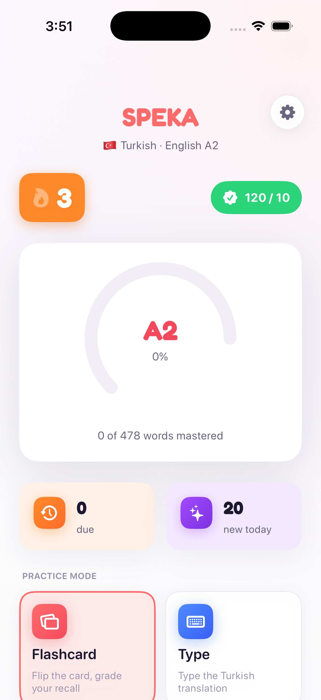
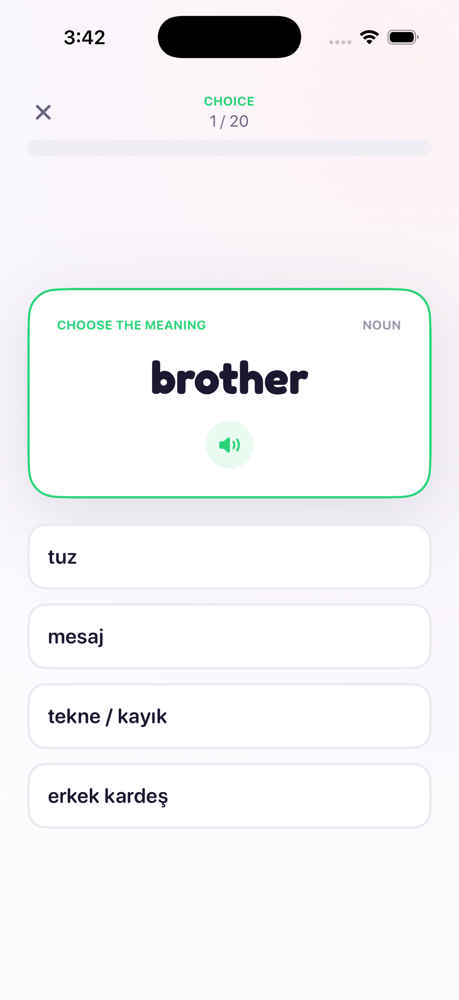
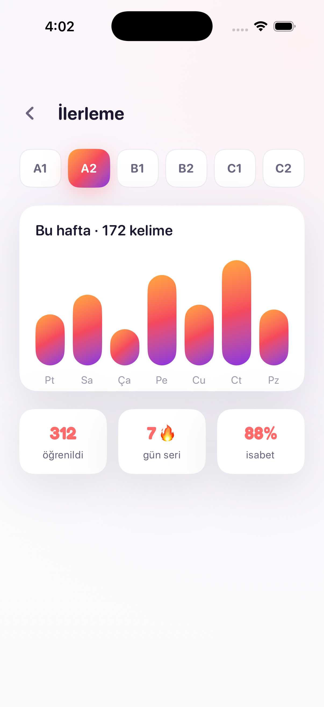
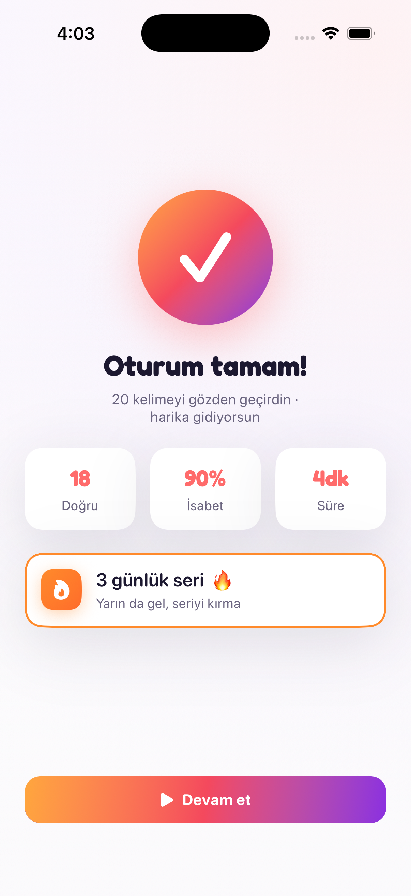

<div align="center">


# SPEKA

**Learn English vocabulary — one confident word at a time.**

A CEFR-leveled vocabulary trainer with SM-2 spaced repetition, four study modes,
and a vibrant, fully native iOS design.


</div>

---

## Screenshots

<div align="center">
<table>
<tr>
<td align="center"><br><sub><b>Home</b></sub></td>
<td align="center"><br><sub><b>Study · Choice</b></sub></td>
<td align="center"><br><sub><b>Progress</b></sub></td>
<td align="center"><br><sub><b>Session summary</b></sub></td>
</tr>
</table>
</div>

---

## ✨ Features

- **Four ways to study** — Flashcard, Type, Listen, and Multiple Choice, each with its own colour identity.
- **SM-2 spaced repetition** — every word is scheduled by the proven SuperMemo-2 algorithm, so you review right before you'd forget.
- **CEFR-leveled** — vocabulary organised A1 → C2 (A1 and A2 packs ship seeded: **757 words**).
- **Learn from your own language** — pick Turkish, German, French, Spanish, or Italian; SPEKA always teaches English.
- **Daily goals & streaks** — a daily queue blends due reviews with fresh words up to your target, with a streak to keep you honest.
- **Progress you can see** — CEFR level path, a weekly activity chart, accuracy and streak stats.
- **Local-first** — no account, no backend; your progress lives on device.
- **Fully native** — SwiftUI for iOS 17+, Swift 6 with complete strict concurrency, zero third-party runtime dependencies.

---

## 🎯 Study modes

| Mode | What you do |
|------|-------------|
| **Flashcard** | Flip the card, then self-grade your recall: *Again · Good · Easy* (drives the SM-2 interval). |
| **Type** | Type the English word from its meaning in your native language. |
| **Listen** | Hear the word spoken, then spell it back. |
| **Multiple Choice** | Pick the correct meaning from four options. |

---

## 🧠 How it learns

Each word moves through a lifecycle — **new → learning → review → known** — driven by the
`SM2Scheduler` in `VocabularyKit`. Your grade on every card adjusts its ease and next interval;
the `DailyQueueBuilder` then assembles each session from the reviews that are due plus new words,
capped at your daily goal.

---

## 🎨 Design — "Palette C"

A clean, energetic look built on a **neutral white canvas** with a signature
**brand gradient** (`#FFA63D → #F4495D → #8B2FE0`) on the progress ring and primary actions,
plus a distinct accent per study mode (coral · blue · purple · green) and **Pip**, the in-app mascot.
The whole system is centralised in the `SpekaUI` package, so the app re-themes from one place.

---

## 🏗 Architecture

SPEKA is split into focused Swift packages with a thin app target on top:

- **`VocabularyKit`** — the domain. Models (`Word`, `Translation`, `ReviewState`, `UserProgress`,
  `StudySession`), the SM-2 scheduler, the daily-queue builder, and seed import. **No UI.**
- **`SpekaUI`** — the design system. Colour tokens, gradient components (`SpekaRing`, `SpekaButton`,
  `SpekaCard`, `SpekaChip`, `SpekaProgressBar`, badges) and the Pip mascot. **No domain dependency.**
- **`GridBaseUIKit`** — shared GridBase primitives.
- **App target** — `Features/` (Home, Study, Onboarding, Settings, Progress) and `Data/` stores,
  bridging the domain enums to the design system in `Support/SpekaTheme.swift`.

The Xcode project is generated with [XcodeGen](https://github.com/yonaskolb/XcodeGen) from `project.yml`.

---

## 🚀 Getting started

**Requirements:** Xcode 16+, iOS 17+ simulator or device.

```bash
git clone https://github.com/thegridbase-ai/Speka.git
cd Speka

# Optional — regenerate the Xcode project from project.yml
brew install xcodegen && xcodegen

open Speka.xcodeproj
```

Select the **Speka** scheme and run on an iOS 17+ simulator.

Run the package tests with `swift test` inside `Packages/VocabularyKit` (and `Packages/SpekaUI`),
or ⌘U from Xcode.

---

## 📁 Project structure

```
Speka/
├─ Speka/                    # App target
│  ├─ App/                   # Entry point + router
│  ├─ Features/              # Home · Study · Onboarding · Settings · Progress
│  ├─ Data/                  # Catalog, WordStore, StatsStore, ProfileStore, SeedLoader
│  ├─ Support/               # SpekaTheme, Haptics, Speaker
│  └─ Resources/             # Assets + Seed (words_a1.json, words_a2.json)
├─ Packages/
│  ├─ VocabularyKit/         # Domain: models, SM-2, daily queue, seed
│  ├─ SpekaUI/               # Design system: tokens, components, Pip mascot
│  └─ GridBaseUIKit/         # Shared GridBase primitives
├─ docs/screenshots/         # README imagery
└─ project.yml               # XcodeGen project definition
```

---

## 🗺 Roadmap

- [ ] B1–C2 vocabulary packs
- [ ] App icon & onboarding polish
- [ ] iCloud sync across devices
- [ ] Home-screen widgets & study reminders

---

## Part of TheGridBase

SPEKA is part of TheGridBase's native iOS lineup, alongside
**RiffForge**, **ChordExplorer**, and **Haptic**.

---

<sub>© 2026 TheGridBase. All rights reserved.</sub>
